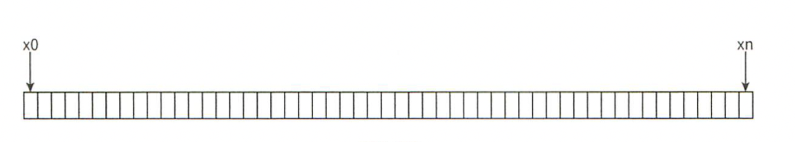
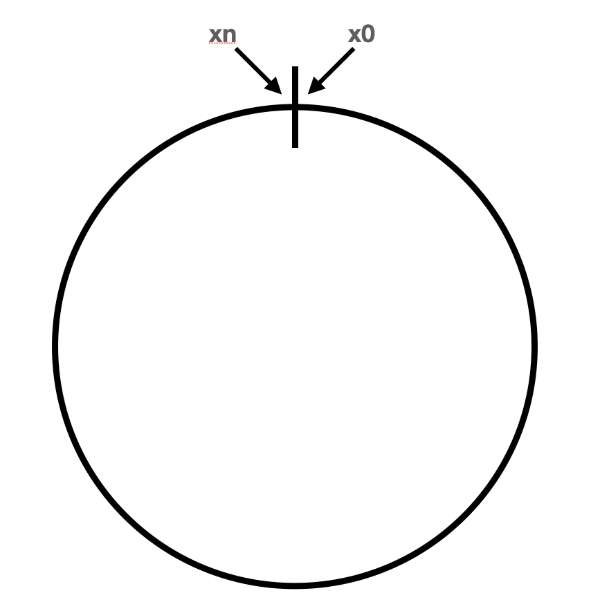
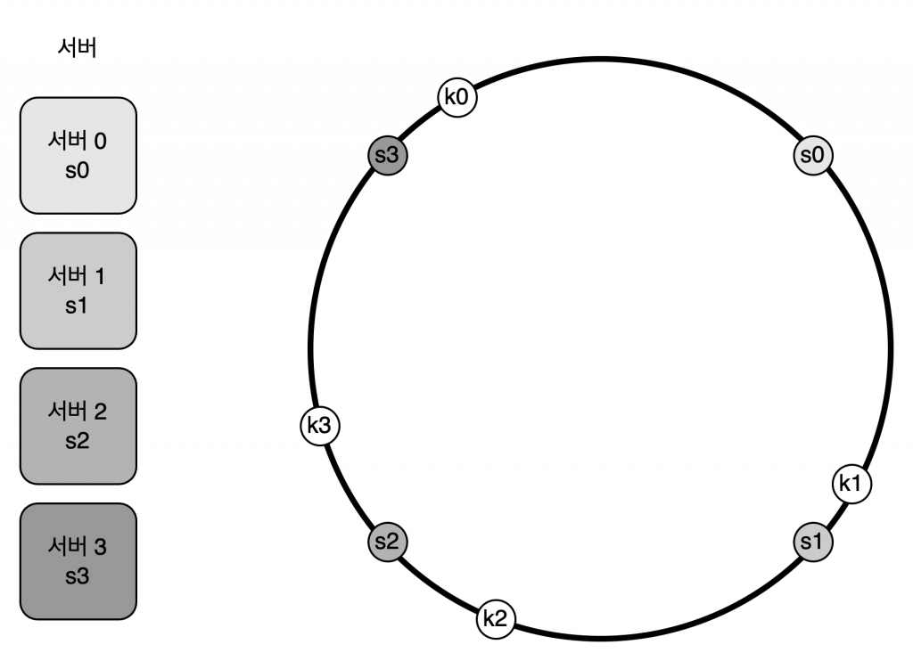
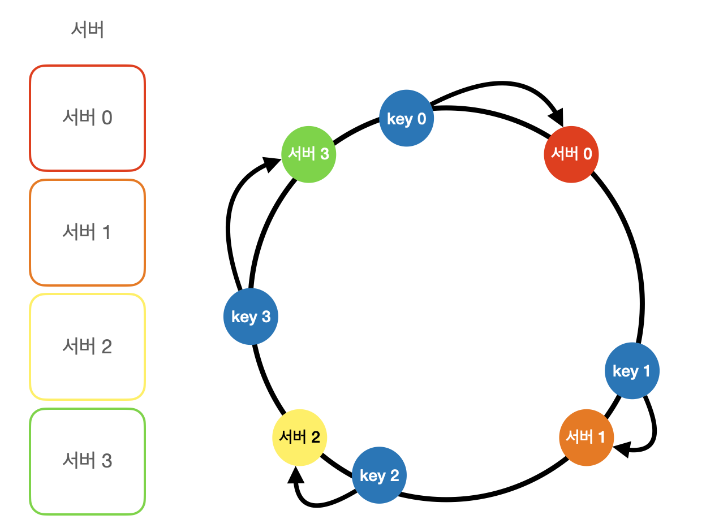
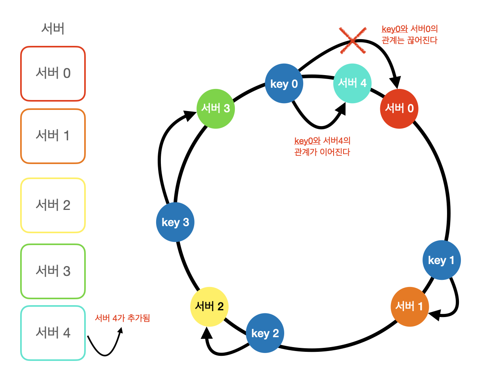
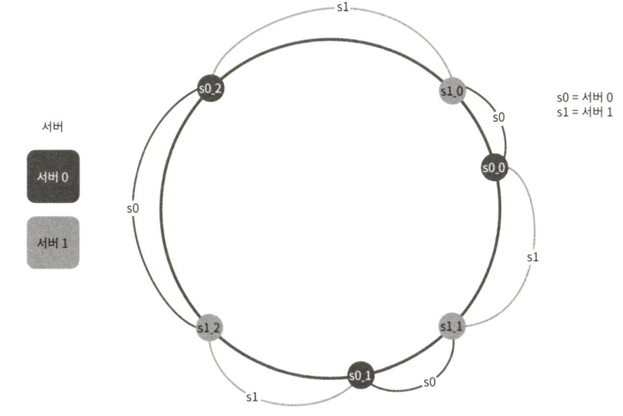

# 안정 해시 설계

## 목차

- [해시 키 재배치 문제](#해시-키-재배치-문제)
- [안정 해시(Consitent Hash)](#안정-해시consitent-hash)
- [해시 공간과 해시 링](#해시-공간과-해시-링)
- [서버 조회](#서버-조회)
- [서버 추가](#서버-추가)
- [서버 제거](#서버-제거)
- [안정 해시 기본 구현법의 두 가지 문제](#안정-해시-기본-구현법의-두-가지-문제)
- [Adaptive Consistent Hash - 가상 노드(Virtual Node), 복제(Replica)](#adaptive-consistent-hash---가상-노드virtual-node-복제replica)
- [마치며](#마치며)
- [추가](#추가)

---

## 해시 키 재배치 문제

일반적인 해시 자료구조는 키가 담길 버킷을 해시 값(hash(key))을 버킷의 수(N)로 나누는 방식으로 구해서 버킷의 수(N)가 바뀌면 대부분의 데이터를 새로 배치해야 한다.

```
int index = hash(key) % N
```

[Java](https://docs.oracle.com/en/java/javase/21/docs/api/java.base/java/util/HashMap.html)의 경우 기본 버킷의 수는 16, 기본 load factor는 0.75로 전체 버킷의 75% 이상이 채워지면 버킷의 수를 2배로 늘리고 버킷의 수가 바뀌었으므로 전체 데이터를 재배치하는 Rehashing이 발생하며 대부분의 데이터가 재배치된다.

이런 해시 알고리즘의 단점

- Rehashing 시 전체 데이터에 대해 버킷을 다시 지정하는 O(N)의 시간복잡도 소요
- Rehashing의 부하를 줄이기 위해 사용하지 않는 버킷을 둠(데이터 삽입, 삭제가 O(1)로 가능)
- 해시 충돌에 의한 미약한 성능 감소(Separate Chaining에 의한 LinkedList or Red-Black Tree 탐색)

---

## 안정 해시(Consitent Hash)

수평적 규모 확장성을 달성하기 위해 요청 또는 데이터를 서버에 균등하게 나누고자할 때 이런 해시의 장점을 활용하면서 단점을 상쇄할 수 있는 기술이 안정 해시

안정 해시는 해시 테이블의 크기가 조정될 때 평균적으로 k/n개의 키만 재배치하는 해시 기술이다. 여기서 k는 키의 개수, n은 슬롯의 개수다. n개의 캐시 서버에 부하를 균등하게 나누는 상황에서 모듈러 연산을 사용하는 일반적인 해시 함수를 활용할 경우 캐시 서버의 수가 고정되어 있으면 잘 동작하지만 캐시 서버의 수가 늘어나거나 줄어들면 캐시 미스가 발생하게 되고 이 때문에 대부분의 데이터를 재배치해야 한다.

---

## 해시 공간과 해시 링

해시 공간(Hash Space)은 해시 함수가 반환할 수 있는 값의 범위이고 해시 링(Hash Ring)은 이 해시 공간의 양 끝을 연결한 것이다.




해시 링 위에 서버들을 임의로 배치할 수 있으며 해시 값이 해시 링 위의 임의의 한 점에 대응돼서 더 이상 모듈러 연산을 사용하지 않아도 된다.



---

## 서버 조회

어떤 키가 저장되는 서버는 해당 키의 위치로부터 시계 방향으로 링을 탐색해나가면서 만나는 첫 번째 서버다.



- key0 -> 서버 0
- key1 -> 서버 1
- key2 -> 서버 2
- key3 -> 서버 3

---

## 서버 추가

서버 4를 추가하더라도 key0 -> 서버0을 key0 -> 서버4로 재배치만 하면 되며 모든 키를 재배치하지 않아도 된다.



---

## 서버 제거

서버 1을 제거하더라도 key1 -> 서버1을 key1 -> 서버2로 재배치만 하면 되며 모든 키를 재배치하지 않아도 된다.


---

## 안정 해시 기본 구현법의 두 가지 문제

- 서버가 추가되거나 삭제되는 상황에서 파티션의 크기(인접한 서버 사이의 해시 공간)를 균등하게 유지하는 게 불가능하다.
- 키의 균등 분포를 달성하기가 어렵다.

---

## Adaptive Consistent Hash - 가상 노드(Virtual Node), 복제(Replica)

가상 노드는 실제 노드 또는 서버를 가리키는 노드로 하나의 서버는 해시 링 위에 여러 개의 가상 노드를 가질 수 있다.



- 서버 0은 s0_0, s0_1, s0_2 세 개의 가상 노드를 가진다.
- 서버 1은 s1_0, s1_1, s1_2 세 개의 가상 노드를 가진다.

가상 노드를 통해 각 서버는 하나의 큰 파티션이 아닌 여러 개의 작은 파티션을 가질 수 있고, 이를 통해 키의 균등 분포를 이룰 수 있다. 가상 노드의 수를 늘릴수록 키의 분포가 점점 더 균등해지지만 가상 노드 데이터를 저장할 공간이 더 많이 필요해지게 될 것이므로 적절한 트레이드 오프가 필요하다.

---

## 마치며

- 안정 해시를 통해 서버가 추가되거나 삭제될 때 재배치되는 키의 수가 최소화 된다.
- 데이터가 보다 균등하게 분포하게 되므로 수평적 규모 확장성을 달성하기 쉽다.
- 핫스팟(Hotspot) 키 문제를 줄인다.

---

# 추가

- Jump Consistent Hash라는 것도 있는데 이해하기 어려워서 본문에서는 제외했다.
- 안정 해시 적용시 키에 대한 조회 부분이 선형 탐색처럼 나와 있어서 평균적으로 O(k/n)의 시간복잡도가 소요될 것으로 예상됐고 GPT 피셜 노드들이 해시 공간 상에 정렬되어 있어서 이진 탐색으로 O(log N)으로 조회도 가능하다고 했는데 관련된 자료는 못찾겠어서 제외했다.(키에 대한 삽입, 수정, 삭제 모두 조회 이후 발생하는 상황이고 해당 서버에서 실제 동작은 서버 구현에 따라 달라질 듯)

---
