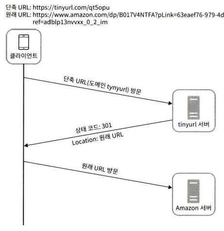

# URL 단축기 설계

## 목차

- [단축 URL(URL Shortening)이란?](#단축-urlurl-shortening이란)
- [단축 URL의 특징](#단축-url의-특징)
- [면접 시나리오 및 개략적 추정](#면접-시나리오-및-개략적-추정)
- [개략적 설계안](#개략적-설계안)
- [상세 설계](#상세-설계)
- [Ref](#ref)

---

## 단축 URL(URL Shortening)이란?

```
단축 URL은 말 그대로 긴 URL을 짧은 URL로 변환한 것으로 짧은 URL로 온 요청을 긴 URL로 리다이렉션(3xx)하는 원리(with Location 헤더)
```

ex)

유튜브 영상 URL https://www.youtube.com/watch?v=R8ND9EJ8vE8  
-> 해당 영상 공유 URL https://youtu.be/R8ND9EJ8vE8

내 깃허브 https://github.com/FickleBoBo  
-> buly.kr 단축 URL 서비스 https://buly.kr/BpFcqZ2

---

## 단축 URL의 특징

장점

- URL의 길이가 짧아져서 텍스트 양의 제한이 있을 경우 공간 절약 및 가독성 향상(SNS, SMS 등)
- 실시간 클릭 수, 시간대별 및 지역별 분석, 디바이스 및 브라우저 정보, 유입경로 트래킹 등 분석 활용
- 하나의 긴 URL에 여러 단축 URL을 생성하면 마케팅 효과 측정에 활용 가능
- QR 코드 생성 시 스캐닝 안정성 향상

단점

- 악성 링크에 단축 URL을 적용해서 숨길 수 있음

-> URL 길이 단축 및 리다이렉트 전 비즈니스 로직을 추가할 수 있는게 주요 사용 이유인듯

---

## 면접 시나리오 및 개략적 추정

### 1. 면접

1. 지원자: URL 단축기가 어떻게 동작해야 하는지 예제를 보여주실 수 있을까요?

2. 면접관: https://www.systeminterview.com/q=chatsystem&c=loggedin&v=v3&l=long이 입력으로 주어졌다고 해 봅시다. 이 서비스는 https://tinyurl.com/y7ke-ocwj와 같은 단축 URL을 결과로 제공해야 합니다. 이 URL에 접속하면 원래 URL로 갈 수도 있어야 하죠.

3. 지원자: 트래픽 규모는 어느 정도일까요?

4. 면접관: 매일 1억 개의 단축 URL을 만들어 낼 수 있어야 합니다.

5. 지원자: 단축 URL의 길이는 어느 정도여야 하나요?

6. 면접관: 짧으면 짧을수록 좋습니다.

7. 지원자: 단축 URL에 포함될 문자에 제한이 있습니까?

8. 면접관: 단축 URL에는 숫자와 영문자만 사용할 수 있습니다.

9. 지원자: 단축된 URL을 시스템에서 지우거나 갱신할 수 있습니까?

10. 면접관: 시스템을 단순화하기 위해 삭제나 갱신을 할 수 없다고 가정합시다.

### 2. 추정치 계산

- 쓰기 연산: 매일 1억 개의 단축 URL 생성 시 초당 1,160회 발생(1억 / 24 / 3600 = 1160)
- 읽기 연산: 읽기, 쓰기 연산 비율을 10:1로 가정 시 초당 11,600회 발생(1160 \* 10 = 11600)
- 10년간 서비스 운영 시 3,650억개의 레코드 보관, 레코드 당 100바이트 용량 소요 시 총 36.5TB의 저장 용량 필요

---

## 개략적 설계안

### 1. API 엔드포인트

URL 단축용 엔드포인트

- 새 단축 URL을 생성하고자 하는 클라이언트는 이 엔드포인트에 단축할 URL을 담아서 요청을 보내면 단축 URL을 반환 받음

URL 리다이렉션용 엔드포인트

- 단축 URL에 대해서 HTTP 요청이 오면 원래 URL로 보내주기 위한 용도의 엔드포인트

### 2. URL 리다이렉션

브라우저에 단축 URL 입력 시 단축 URL을 받은 서버는 301(Moved Permanently) 또는 302(Found) 상태코드와 Location 헤더에 원래 URL을 담아서 리다이렉션(301은 영구적 리다이렉션, 302는 일시적 리다이렉션)




### 3. URL 단축

URL 단축을 하는 방법은 긴 URL을 짧은 URL로 변환하는 해시 함수를 통해 할 수 있다.

해시 함수의 요구사항

- 긴 URL이 다른 값이면 해시 값도 달라져야 한다.
- 계산된 해시 값은 원래 입력으로 주어졌던 긴 URL로 복원될 수 있어야 한다.

---

## 상세 설계

### 데이터

단축 URL, 원래 URL을 RDB에 저장(필요 시 소유자, 만료일 등 별도 컬럼 추가), 필요시 캐싱 추가

### 해시 함수

요구사항에서 숫자와 영문자만 사용 가능하다했으므로 사용가능한 문자수는 10 + 26 + 26 = 62개이고, 레코드 추정치가 3,650억개이므로 62^7 = 3.5조, 즉 7자리의 조합으로 구현 가능

해시 함수의 구현은 <u>해시 충돌 후 해소 방법</u>과 <u>base-62 변환 방법</u> 2가지가 크게 있다.

해시 충돌 후 해소 방법은 잘 알려진 해시 함수(SHA-1 등)에서 얻은 값에서 앞 7자리만 사용하고 충돌 시 사전에 정한 문자열을 URL에 덧붙인 후 다시 해시 값을 계산하는 과정을 반복하는 것이다. 항상 일정한 길이의 단축 URL을 얻을 수 있고 다른 단축 URL을 알아내는 것이 어렵지만 해시 충돌 해소 전략이 필요하고 데이터베이스 반복 쿼리 오버헤드가 있다.(블룸 필터를 쓰면 공간 효율을 높일 수 있다는데 사용하는게 맞는지 의심스럽고 블룸 필터는 약간 심화 내용인듯)

base-62 변환 방법은 원래 URL을 ID 생성기를 통해 수를 얻은 후 이를 62진법으로 변환한 값을 단축 URL로 사용하는 방식이다. ID 생성기 덕분에 충돌이 불가능하지만 단축 URL 길이가 가변적이고 ID 생성기가 +1로 생성 시 다른 단축 URL을 쉽게 유추할 수 있다.

---

## Ref

- [위키피디아 - URL shortening](https://en.wikipedia.org/wiki/URL_shortening)
- [비볼디 - 왜 긴 링크를 짧게 줄여서 사용할까? 단축URL을 사용하는 이유!](https://vivoldi.com/blog/url-shortener/why-use-long-links-to-be-shortened)
- [비볼디 - 단축 URL을 사용하여 실시간 클릭 수를 추적하는 방법](https://vivoldi.com/blog/url-shortener/track-realtime-clicks)

---
