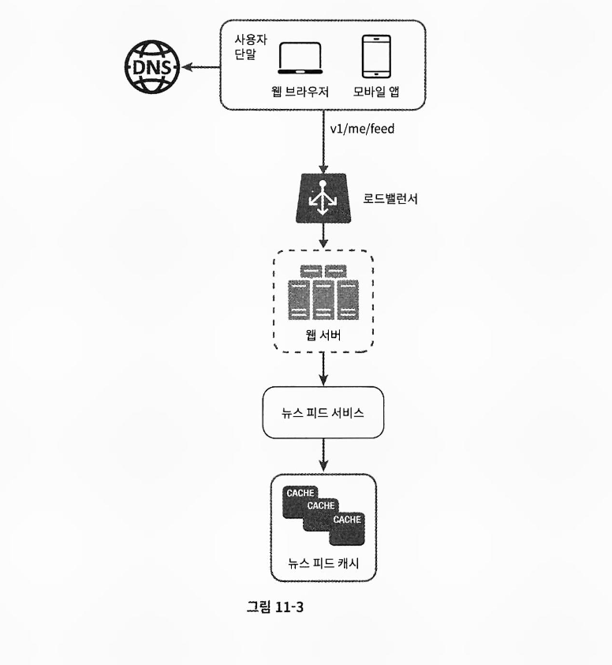

# 뉴스 피드 시스템 설계

## 목차

- [면접 시나리오](#면접-시나리오)
- [개략적 설계](#개략적-설계)
- [상세 설계](#상세-설계)
- [후기](#후기)

---

## 면접 시나리오

1. 지원자: 모바일 앱을 위한 시스템인가요? 아니면 웹? 둘 다 지원해야 합니까?
2. 면접관: 둘 다 지원해야 합니다.
3. 지원자: 중요한 기능으로는 어떤 것이 있을까요?
4. 면접관: 사용자는 뉴스 피드 페이지에 새로운 스토리를 올릴 수 있어야 하고, 친구들이 올리는 스토리를 볼 수도 있어야 합니다.
5. 지원자: 뉴스 피드에는 어떤 순서로 스토리가 표시되어야 하나요? 최신 포스트가 위에 오도록 해야 하나요? 아니면 토픽 점수(topic score) 같은 다른 기준이 있습니까? 예를 들어, 가까운 친구의 포스트는 좀 더 위에 배치되어야 한다든가 하는.
6. 면접관: 그냥 시간 흐름 역순(reverse chronological order)으로 표시된다고 가정합시다.
7. 지원자: 한 명의 사용자는 최대 몇 명의 친구를 가질 수 있습니까?
8. 면접관: 5,000명입니다.
9. 지원자: 트래픽 규모는 어느 정도입니까?
10. 면접관: 매일 천만 명이 방문한다고 가정합시다(10million DAU).
11. 지원자: 피드에 이미지나 비디오 스토리도 올라올 수 있습니까?
12. 면접관: 스토리에는 이미지나 비디오 등의 미디어 파일이 포함될 수 있습니다.

- 웹과 앱 모두 지원
- 뉴스 피드 생성, 조회 기능(최신순)
- 최대 친구 수 5,000명
- 일 방문자 천만명
- 뉴스 피드에 미디어 파일 포함 가능

---

## 개략적 설계

뉴스 피드 설계안은 1) 뉴스 피드 발행(feed publishing)과 2) 뉴스 피드 생성(feed building) 두 가지 부분으로 나누었다.

### 1. 뉴스 피드 발행

사용자가 스토리를 포스팅하면 해당 데이터를 캐시와 데이터베이스에 기록한다. 새 포스팅은 친구의 뉴스 피드에도 전송된다.

- 포스팅 저장 서비스: 새 포스팅을 데이터베이스와 캐시에 저장한다.
- 포스팅 전송 서비스: 새 포스팅을 친구의 뉴스 피드에 푸시한다. 뉴스 피드 데이터는 캐시에 보관하여 빠르게 읽어갈 수 있도록 한다.
- 알림 서비스: 친구들에게 새 포스팅이 올라왔음을 알리거나, 푸시 알림을 보내는 역할을 담당한다.

### 2. 뉴스 피드 생성

지면 관계상 뉴스 피드는 모든 친구의 포스팅을 시간 흐름 역순으로 모아서 만든다고 가정한다.

- 뉴스 피드 서비스: 캐시에서 뉴스 피드를 가져오는 서비스다.
- 뉴스 피드 캐시: 뉴스 피드를 렌더링할 때 필요한 피드 ID를 보관한다.

---

## 상세 설계

### 1. 쓰기 시점에 팬아웃(fanout-on-write), push 모델

새로운 포스팅을 기록하는 시점에 뉴스 피드를 갱신하는 모델

장점

- 뉴스 피드가 실시간으로 갱신되며 친구 목록에 있는 사용자에게 즉시 전송된다.
- 새 포스팅이 기록되는 순간에 뉴스 피드가 이미 갱신되므로 뉴스 피드를 읽는 데 드는 시간이 짧아진다.

단점

- 친구가 많은 사용자의 경우 친구 목록을 가져오고 그 목록에 있는 사용자 모두의 뉴스 피드를 갱신하는 데 많은 시간이 소요될 수 있다.(핫키 문제)
- 서비스를 자주 이용하지 않는 사용자의 피드까지 갱신해야 하므로 컴퓨팅 자원이 낭비된다.

### 2. 읽기 시점에 팬아웃(fanout-on-read), pull 모델

피드를 읽어야 하는 시점에 뉴스 피드를 갱신하는 모델

장점

- 비활성화된 사용자, 또는 서비스에 거의 로그인하지 않는 사용자의 경우에 로그인하기전까지는 어떤 컴퓨팅 자원도 소모하지 않는다.
- 데이터를 친구 각각에 푸시하는 작업이 필요 없으므로 핫키 문제도 생기지 않는다.

단점

- 뉴스 피드를 읽는 데 많은 시간이 소요될 수 있다.

### 포스팅 전송 서비스 설계

push 모델과 pull 모델을 결합하여 장점은 살리고 단점은 보완하도록 설계한다. 뉴스 피드를 빠르게 가져올 수 있도록 하는 것은 아주 중요하므로 대부분의 사용자에 대해서는 push 모델을 사용하고 친구나 팔로워가 아주 많은 사용자에 대해서는 팔로워로 하여금 해당 사용자의 포스팅을 필요할 때 가져가도록 하는 pull 모델을 사용하여 시스템 과부하를 방지한다.

1. 그래프 데이터베이스에서 친구 ID 목록을 가져온다.
2. 사용자 정보 캐시에서 친구들의 정보를 가져온 후 사용자 설정에 따라 일부를 걸러낸다.(친구지만 포스팅을 보고 싶지 않은 경우)
3. 친구 목록과 새 스토리의 포스팅 ID를 메시지 큐에 넣는다.
4. 포스팅 전송 작업 서버가 메시지 큐에서 데이터를 꺼내 뉴스 피드 데이터를 뉴스 피드 캐시에 넣는다. 뉴스 피드 캐시는 포스팅 ID, 사용자 ID의 순서쌍을 보관하는 매핑 테이블로 포스팅 정보 전부를 저장할 경우 메모리 요구량이 지나치게 높아질 수 있다.

### 피드 읽기 흐름 설계

이미지나 비디오와 같은 미디어 콘텐츠는 CDN에 저장하여 빨리 읽어갈 수 있도록 한다.

1. 사용자가 뉴스 피드를 읽으려는 요청을 보내면 2) 로드밸런서가 요청을 웹 서버 가운데 하나로 보낸다. 3) 웹 서버는 피드를 가져오기 위해 뉴스 피드 서비스를 호출하고 4) 뉴스 피드 서비스는 뉴스 피드 캐시에서 포스팅 ID 목록을 가져온다. 5) 뉴스 피드에 표시할 사용자 이름, 사용자 사진, 포스팅 콘텐츠, 이미지 등을 사용자 캐시와 포스팅 캐시에서 가져와 완전한 뉴스 피드를 만든다.

캐시의 경우 뉴스 피드의 핵심 컴포넌트로 본 설계안에서는 다섯 계층으로 나눈다.

---

## 후기

뉴스 피드 시스템은 그냥 게시판인데 친구들의 게시물만 보는 시스템인거 같았다.

이게 면접 질문이었다면 push 모델이 대한 이해가 킥인거 같고 부가로 각종 캐시 전략, 미디어 파일에 대한 CDN, push 모델에서 메시지 큐 도입 정도일듯하다.

친구의 ID 목록을 가져온다는 파트에서 그래프 데이터베이스를 통해 친구 ID 목록을 가져오고 이를 다시 사용자 정보 캐시에서 설정에 따른 필터링을 진행하는 방식으로 교재는 설계했는데 친구의 친구를 구한다거나 하는 기능을 활용할게 아니면 친구나 팔로우 팔로워 기능에 그래프 데이터베이스를 쓸 필요가 있는지 잘 모르겠다.

---
